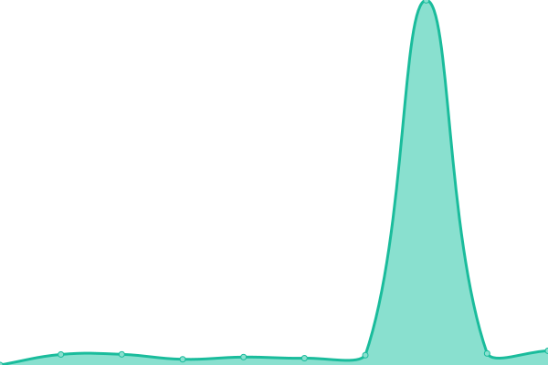
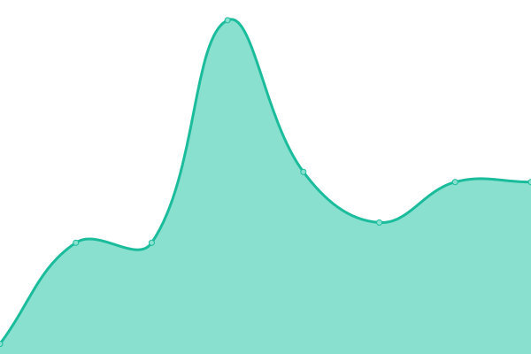
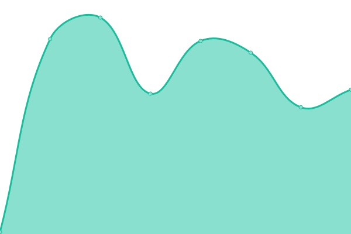

# [📈 Live Status](https://upptime.github.io/upptime): <!--live status--> **🟧 Partial outage**

This repository contains the open-source uptime monitor and status page for [Upptime](https://upptime.js.org), powered by [Upptime](https://github.com/upptime/upptime).

With [Upptime](https://upptime.js.org), you can get your own unlimited and free uptime monitor and status page, powered entirely by a GitHub repository. We use [Issues](https://github.com/upptime/upptime/issues) as incident reports, [Actions](https://github.com/StreamOfRon/macaw-social-status/actions) as uptime monitors, and [Pages](https://upptime.github.io/upptime) for the status page.

<!--start: status pages-->
<!-- This summary is generated by Upptime (https://github.com/upptime/upptime) -->
<!-- Do not edit this manually, your changes will be overwritten -->
<!-- prettier-ignore -->
| URL | Status | History | Response Time | Uptime |
| --- | ------ | ------- | ------------- | ------ |
|  [Macaw-Social Homepage](https://macaw.social) | 🟥 Down | [macaw-social-homepage.yml](https://github.com/StreamOfRon/macaw-social-status/commits/HEAD/history/macaw-social-homepage.yml) | 

 440ms
     
 | 

<a href="https://status.macaw.social/history/macaw-social-homepage">100.00%</a>
    

|  [Macaw-Social Static Object](https://macaw.social/emoji/1f346.svg) | 🟩 Up | [macaw-social-static-object.yml](https://github.com/StreamOfRon/macaw-social-status/commits/HEAD/history/macaw-social-static-object.yml) | 

 14ms
     
 | 

<a href="https://status.macaw.social/history/macaw-social-static-object">100.00%</a>
    

|  [Macaw-Social CDN Object](https://macawsocial.sfo3.cdn.digitaloceanspaces.com/accounts/avatars/109/275/542/085/388/685/original/a655926f7c4a560a.png) | 🟩 Up | [macaw-social-cdn-object.yml](https://github.com/StreamOfRon/macaw-social-status/commits/HEAD/history/macaw-social-cdn-object.yml) | 

 65ms
     
 | 

<a href="https://status.macaw.social/history/macaw-social-cdn-object">100.00%</a>
    

<!--end: status pages-->

[**Visit our status website →**](https://status.macaw.social)

## 📄 License

- Powered by: [Upptime](https://github.com/upptime/upptime)
- Code: [MIT](./LICENSE) © [Upptime](https://upptime.js.org)
- Data in the `./history` directory: [Open Database License](https://opendatacommons.org/licenses/odbl/1-0/)
